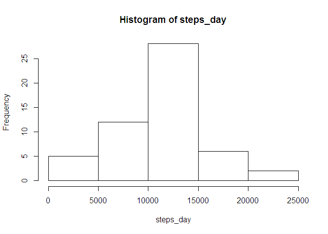
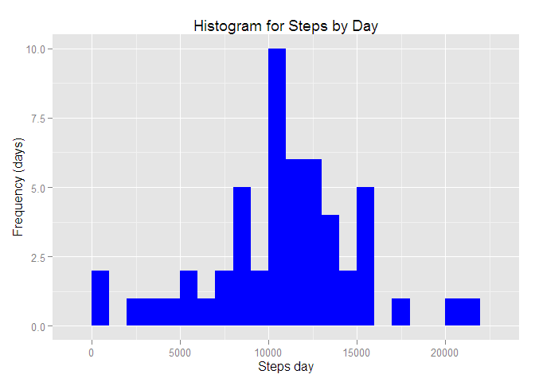
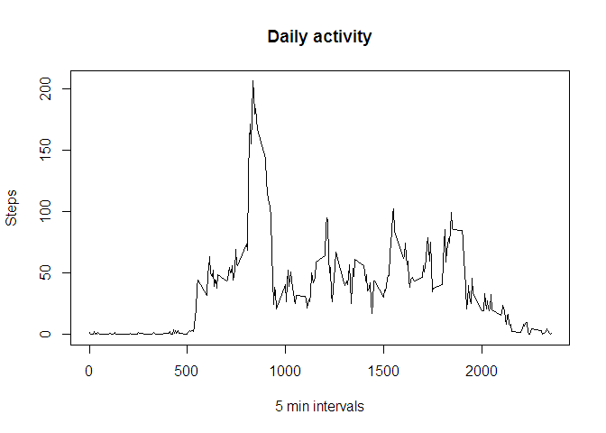
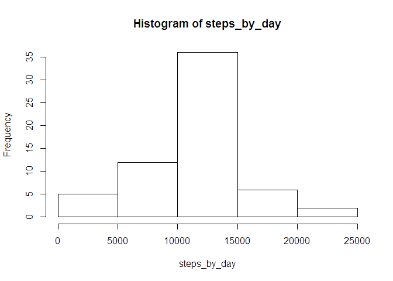
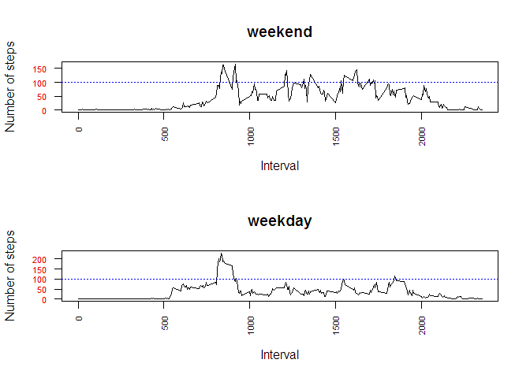

# Reproducible Research: Peer Assessment 1


## Loading and preprocessing the data


```r
#zip file in working directory and read.csv function default na.strings 
activity <- read.csv(unz("activity.zip","activity.csv"))

#format column date into date values 
activity$date <- as.Date(activity$date)


#packages used; uncomment to install if needed
# install.packages("ggplot2")
# install.packages("lattice")
# install.packages("lubridate")

#libraries used
library("ggplot2")
library("lattice")
library("lubridate")
```

## What is mean total number of steps taken per day?


```r
steps_day <-  aggregate(steps ~ date, activity, sum)$steps
```

Make a histogram of the total number of steps taken each day


```r
#base
hist(steps_day)
```

 


```r
#pretty ggplot2 with different grouping of results
qplot(steps_day,
      geom="histogram",
      binwidth=1000,
      main = "Histogram for Steps by Day", 
      xlab = "Steps day",
      ylab = "Frequency (days)",
      fill=I("blue"))
```

 

Calculate and report the mean and median of the total number of steps taken per day


```r
mean(steps_day)
```

```
## [1] 10766.19
```

```r
median(steps_day)
```

```
## [1] 10765
```

## What is the average daily activity pattern?

Time serie plot


```r
steps_by_interval <- aggregate(steps ~ interval, activity, mean)
plot(steps_by_interval, type = "l", main ="Daily activity", xlab = "5 min intervals", ylab = "Steps")
```

 

Finding the daily interval with max steps on average.


```r
steps_by_interval$interval[which.max(steps_by_interval$steps)]
```

```
## [1] 835
```

Which makes sense according the peak in the plot.

## Imputing missing values

1. Calculate the number of missing values


```r
sum(!complete.cases(activity))
```

```
## [1] 2304
```

2. Filling strategy

We have to find where the value are missing.


```r
sum(!complete.cases(activity$steps))
```

```
## [1] 2304
```

```r
sum(!complete.cases(activity$interval))
```

```
## [1] 0
```

```r
sum(!complete.cases(activity$date))
```

```
## [1] 0
```

So all are missing steps, then I am going to use the mean for that interval without NAs, we got at **steps_by_interval**.


```r
filled_activity <- merge(activity, steps_by_interval, by = "interval", suffixes = c("", ".y"))
nas <- is.na(filled_activity$steps)
filled_activity$steps[nas] <- filled_activity$steps.y[nas]
filled_activity <- filled_activity[, c(1:3)]
```

3. Creating a new dataset with filled values


```r
steps_by_day <- aggregate(steps ~ date, data = filled_activity, sum)$steps
```

4. Histogram, mean and median


```r
hist(steps_by_day)
```

 

```r
mean(steps_by_day)
```

```
## [1] 10766.19
```

```r
median(steps_by_day)
```

```
## [1] 10766.19
```

The overall impact is very low with this filling strategy.


## Are there differences in activity patterns between weekdays and weekends?

Considering weekends, saturday and sunday, and weekdays the rest of the days I add a column with the new data.

To find the day of the week I am using wday from lubridate package. Function wday returns the day of the week as a decimal number (01-07, Sunday is 1).


```r
filled_activity$day_type <- ifelse(wday(filled_activity$date) %in% c(1,7) ,"weekend", "weekday")
filled_activity <- transform(filled_activity, day_type = factor(day_type))
```

I am using the same base plot design to make it easy to compare.


```r
par(mfrow = c(2, 1), cex.axis=0.7, las=2)
for (type in c("weekend", "weekday")) {
    steps_by_day_type <- aggregate(steps ~ interval, 
                                   data = filled_activity, 
                                   subset = filled_activity$day_type == 
                                      type, 
                                   FUN = mean)
    plot(steps_by_day_type, type = "l", main = type, ylab ="Number of steps", xlab="Interval")
    axis(2,  col.axis="red")
    abline(100,0, col="blue", lty=3)
}
```

 

I have colored red Y axis ticks to make clear that the values are not the same for both graphics and I have drawn a dotted blue line at 100.

We can check that at weekends there are more active intervals than at weekdays but the peak happens in weekdays.

